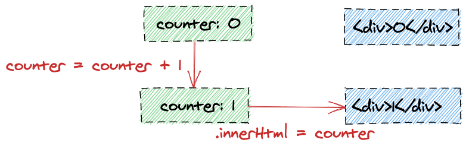
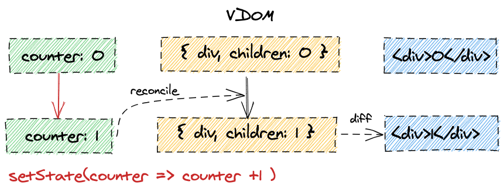
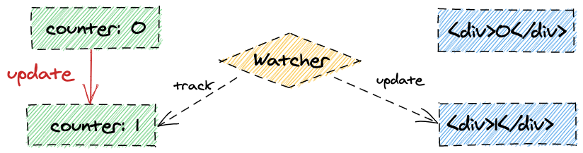
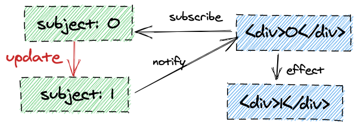
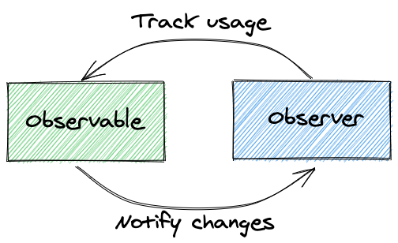
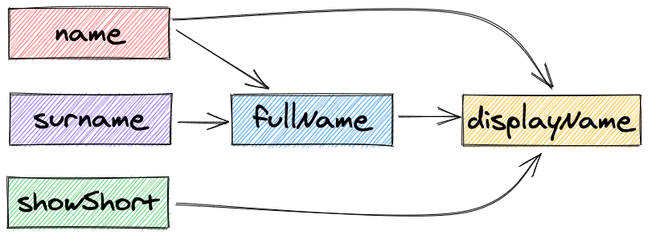

title: MobX course
style: styles.css
output: index.html

---

# **MobX**

https://kontur-web-courses.github.io/mobx/

---

# Практические задачи

Задачки лежат в папке `tasks`, запуск сервера:

```
$ cd tasks
$ npm i
$ npm start
```

По умолчанию, сервер запустится по адресу [http://localhost:3000](http://localhost:3000)

Изменения подхватываются автоматически, перезапускать ничего не нужно

---

# Проблема

Хотим синхронизовано изменять состояние и UI

---

# $-style



- обнови состояние
- синхронизируй весь UI

---

# React-style



- обнови состояние
- обновится VDOM
- посчитаются изменения
- синхронизируется UI

---

# Angular-style



- обнови состояние
- UI следит и сам синхронизируется

---

# RX-style



- обнови состояние
- состояние синхронизирует нужный UI

---

# Svelte-style


- заранее сгенерируй код синхронизации UI

---

# Обратно к истокам

Хотим декларативный механизм, который сам будет знать что нужно обновлять

---

# Реактивное программирование



<!-- Observable, следит за тем, кто его использует, и точечно сообщает им об изменениях -->
<!-- Observer явно рассказывает всем значениям, что они используются -->

---

# Давайте разберём на примере

Смотрим на задачку **0.intro**

---

# Что получилось

- Коробка-значение и реагирование на изменения
- "Граф" связей между значениями и эффектами

---

# Чего не хватает?

---

# Чего не хватает?

- Вычисляемые значения
- Атомарные обновления
- Структуры посложнее

<!-- Структуры в современном MobX сделаны с помощью Proxy -->

---

# Суть MobX


<!-- https://mobx.js.org/the-gist-of-mobx.html -->
<!-- Все производные обновляются автоматически и атомарно, когда состояние меняется. Нельзя увидеть промежуточные значения -->
<!-- Все производные обновляются синхронно, то есть после присваивания значения сразу можно его читать -->
<!-- Вычисляемые значения обновляются лениво. Неиспользуемые значения приостанавливаются и отдаются сборщику мусора -->
<!-- Вычисляемые значения должны быть чистыми и не менять состояние -->

---

# Как с этим разобраться?

MobX — это формулы в Google Sheets

---

# API. Observables

```js
class X {
  constructor() {
    makeObservable(this, {
      // аннотации (observable, action, computed)
    });
    // или с дефолтными настройками:
    makeAutoObservable(this);
  }
}
```

Для Array, Map, и Set есть observable варианты

<!-- https://mobx.js.org/observable-state.html -->

---

# Делаем 1-й пункт задачки **1.api**

---

# API. Actions

- `action` и `action.bound` для аннотаций,
- `runInAction(() => {/*…*/})` для атомарности ручных изменений

По умолчанию, MobX будет ругаться на изменения вне action-ов

<!-- https://mobx.js.org/actions.html -->

---

# Делаем 2-й пункт задачки **1.api**

---

# API. Computed

- `computed` как аннотация для геттеров или
- `const x = computed(() => /*…*/)` для создания оберток

<!-- https://mobx.js.org/computeds.html -->

---

# API. Computed, правила

- должны быть чистыми функциями
- не стоит возвращать новые observable

<!-- https://mobx.js.org/computeds.html#rules -->

---

# Делаем 3-й пункт задачки **1.api**

---

# API. Reactions

```js
const disposer = autorun(() => {
  /*…*/
});
```

Чтобы не получилась утечка по памяти, нужно звать `disposer`, когда реакция больше не нужна

Еще есть [reaction](https://mobx.js.org/reactions.html#reaction) и [when](https://mobx.js.org/reactions.html#when), о них можно почитать отдельно

<!-- https://mobx.js.org/reactions.html -->

---

# API. Как работает отслеживание


<!-- На каждый запуск строится новый список зависимостей, когда зависимость меняется, она запускает все свои реакции -->
<!-- https://mobx.js.org/reactions.html#how-tracking-works -->

---

# API. Reactions, правила

- Запускаются синхронно, сразу после изменения,  
  но не раньше чем закончится самый внешнее action
- Отслеживается только то, что прочитано синхронно во время запуска функции
- Не отслеживается то, что прочитано во время action-ов

<!-- https://mobx.js.org/reactions.html#rules -->

---

# API. Асинхронные action-ы

Есть несколько вариантов:

- Каждый коллбек в `.then()` должен быть action-ом

---

# API. Асинхронные action-ы

Есть несколько вариантов:

- Каждый коллбек в `.then()` должен быть action-ом
- Каждому куску кода после `await` нужен отдельный action

---

# API. Асинхронные action-ы

Есть несколько вариантов:

- Каждый коллбек в `.then()` должен быть action-ом
- Каждому куску кода после `await` нужен отдельный action
- Все таски и микротаски оборачивай в action

---

# API. Асинхронные action-ы

Есть несколько вариантов:

- Каждый коллбек в `.then()` должен быть action-ом
- Каждому куску кода после `await` нужен отдельный action
- Все таски и микротаски оборачивай в action
- Делай это с помощью `action` и `runInAction`

<!-- https://mobx.js.org/actions.html#asynchronous-actions -->

---

# API. flow()

Можно использовать `flow` вместо `async/await`:

```js
async function load(store) {
  store.loading = true;
  try {
    const result = await fetch("…");
    runInAction(() => {
      store.value = result;
    });
  } catch (e) {
    runInAction(() => {
      store.error = e;
    });
  } finally {
    runInAction(() => {
      store.loading = false;
    });
  }
}
```

<!-- https://mobx.js.org/actions.html#using-flow-instead-of-async--await- -->

---

# API. flow()

```js
// добавили flow()
const load = flow(
  // function* вместо async
  function* (store) {
    store.loading = true;
    try {
      // yield вместо await
      const result = yield fetch("…");
      store.value = result;
    } catch (e) {
      store.error = e;
    } finally {
      store.loading = false;
    }
  }
);
```

<!-- https://mobx.js.org/actions.html#using-flow-instead-of-async--await- -->
<!-- Про генераторы: https://developer.mozilla.org/en-US/docs/Web/JavaScript/Reference/Statements/function* -->

---

# Делаем задачку **2.async**

---

# Хватит разговоров, нужна практика!

Делаем задачку **3.plan-to-watch**

---

# Граф зависимостей



<!-- Граф считается динамически на каждое вычисление -->
<!-- Есть строгий порядок обновления (топологическая сортировка) -->

---

# Интеграция с React

```jsx
import { observer } from "mobx-react-lite";

const MyComponent = observer((props) => /*…*/);
```

<!-- mobx-react для классов -->

---

# Как работает observer()

- Следит за значениями, прочитанными(**!**) внутри(**!!**) рендера
- Ререндерит компонент, когда зависимости меняются
- Оборачивает в `memo()`

---

# Как работает observer()

- Почти эквивалентно `autorun(() => Component())`

<!-- Все значения, которые пришли в компонент, но не были им прочитаны не вызывают лишних рендеров -->
<!-- Не важно, как значения попали в компонент, важно как они прочитаны -->
<!-- Вложенные выражения работают из коробки -->

<!-- https://mobx.js.org/react-integration.html -->

---

# Локальное и глобальное состояние

- Нет ограничений на то, где "живут" значения
- Можно передавать в props, читать из контекста или из переменных вне компонента

<!-- https://mobx.js.org/react-integration.html#local-and-external-state -->

---

# Глобальное состояние

```jsx
const theThing = makeAutoObservable({
  /*…*/
});
const ThingContext = createContext(theThing);

const PropsThingReader = ({ thing }) => <>{thing.view}</>;
const GlobalThingReader = () => <>{theThing.view}</>;
const ContextThingReader = () => <>{useContext(ThingContext).view}</>;
```

---

# Локальное состояние

Для UI-состояния (лоадеры, выборы, фокусы и т.д.) хватит React

Профит от MobX будет если:

- состояние глубокое
- делится с другими детьми
- или есть вычислимые значения

---

# Локальное состояние

```jsx
const Component = () => {
  const [state] = useState(() => new MyState());
  const [moreState] = useState(() =>
    makeAutoObservable({
      /*…*/
    })
  );
  const evenMoreState = useLocalObservable(() => {
    /*…*/
  });
  /*…*/
};
```

---

# Советы

- Читаешь `observable` — оборачивай в `observer`
- Читай значения как можно глубже в дереве компонентов
- Не передавай `observable` в компоненты без `observer` (используй `toJS`, либо конкретные свойства)
- Некоторые коллбеки и чтения возможно еще придется обернуть
- \* Если нужно синхронизировать локальный `observable` с `props`, используй `useEffect`
- \* Если нужно подписаться в `useEffect`, используй `autorun` (или `reaction`)

<!-- https://mobx.js.org/react-integration.html#always-read-observables-inside-observer-components -->

---

# Как варить бизнес-лапшу

- MobX не диктует строгих правил того, как должны быть организованы модельки
- Часто следуют Flux паттерну, и хранят данные в store-ах
- В приложениях с MobX обычно много моделей, каждая из которых отвечает за какую-то конкретную область знаний и полностью управляет работой с ней
- Иногда отдельную UI-логику тоже выносят в store

---

# Как варить бизнес-лапшу

- MobX не диктует строгих правил того, как должны быть организованы модельки

---

# Как варить бизнес-лапшу

- MobX не диктует строгих правил того, как должны быть организованы модельки
- Часто следуют Flux паттерну, и хранят данные в store-ах

---

# Как варить бизнес-лапшу

- MobX не диктует строгих правил того, как должны быть организованы модельки
- Часто следуют Flux паттерну, и хранят данные в store-ах
- В приложениях с MobX обычно много моделей, каждая из которых отвечает за какую-то конкретную область знаний и полностью управляет работой с ней

---

# Как варить бизнес-лапшу

- MobX не диктует строгих правил того, как должны быть организованы модельки
- Часто следуют Flux паттерну, и хранят данные в store-ах
- В приложениях с MobX обычно много моделей, каждая из которых отвечает за какую-то конкретную область знаний и полностью управляет работой с ней
- Иногда отдельную UI-логику тоже выносят в store

<!-- https://mobx.js.org/defining-data-stores.html -->

---

# React практика

Делаем задачку **4.google-sheets**

---

# Материалы для изучения

- [Документация MobX c примерами](https://mobx.js.org/README.html)
- [Интерактивное введение в MobX](https://mobx.js.org/getting-started)
- [Видео и выступления](https://github.com/mobxjs/mobx#videos)
- [MobX 6 cheat sheet ($)](https://gumroad.com/l/fSocU)

Избранные главы из документации:

- [Конфигурация поведения MobX](https://mobx.js.org/configuration.html)
- [Про реактивность](https://mobx.js.org/understanding-reactivity.html)
- [Про дебаг и анализ](https://mobx.js.org/analyzing-reactivity.html)
- [Написание кастомных observable](https://mobx.js.org/custom-observables.html)
- [Декораторы](https://mobx.js.org/enabling-decorators.html)
